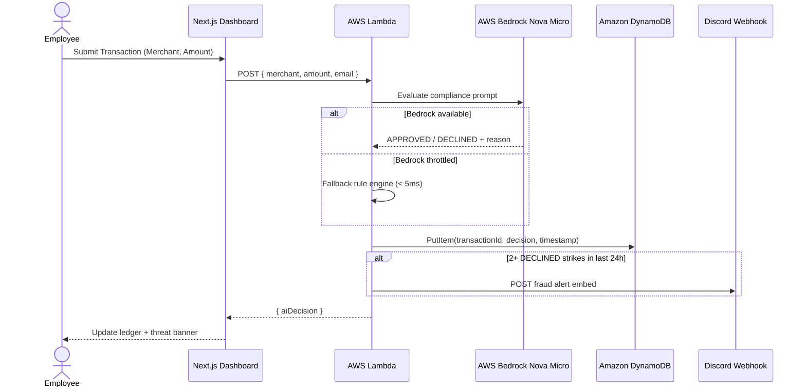
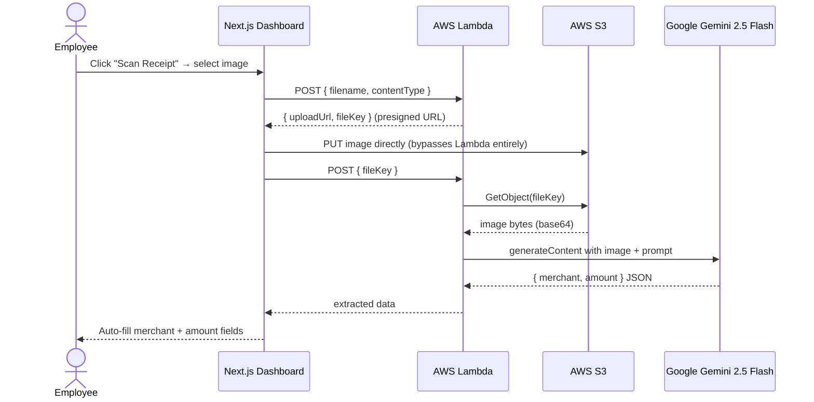
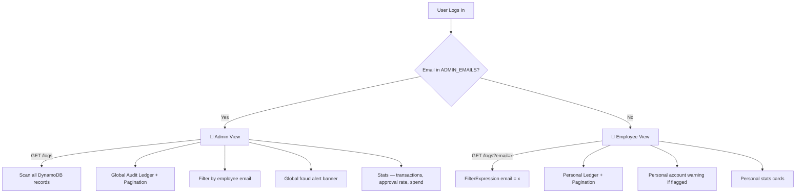

# 🧩 System Components

| Component | Responsibility |
|---|---|
| **Client Browser** | Employees submit expense transactions, upload receipts, and view the audit dashboard. |
| **Supabase Auth** | Handles authentication, JWT sessions, email verification, and password recovery workflows. |
| **Next.js Frontend** | Hosted on Vercel. Provides the dashboard UI, stats cards, transaction forms, receipt scanner, paginated audit ledger, and real-time threat analytics. |
| **AWS Lambda** | Stateless serverless compute layer. Routes all actions by request payload — card swipes, S3 presigned URL generation, and Vision AI receipt analysis. |
| **AWS Bedrock Nova Micro** | Text AI model (`us.amazon.nova-micro-v1:0`) used for intelligent expense evaluation — approves or declines transactions with natural language reasoning. |
| **Google Gemini 2.5 Flash** | Vision AI model used for multimodal receipt scanning — extracts merchant name and total amount from uploaded images. Handles US receipts, Indian GST bills, overlapping receipts, and multi-item formats. |
| **AWS S3** | Stores uploaded receipt images. Browser uploads directly via presigned URL, bypassing Lambda payload limits. |
| **Amazon DynamoDB** | Stores every evaluated transaction as an immutable audit log. Partitioned by `transactionId`. |
| **Fallback Rule Engine** | Deterministic algorithm that activates when Bedrock is throttled. Ensures 100% uptime with zero inference cost. |
| **Discord Webhook** | Receives real-time fraud alerts when an employee accumulates 2+ declined transactions in 24 hours. |

---

# 🔄 Card Swipe Flow

---

# 📸 Vision AI Receipt Scan Flow

---

# 🔐 RBAC & Tenant Isolation

---

# 🧠 AI Architecture — Hybrid Design

The backend implements a **two-tier hybrid AI pipeline**:

## Tier 1A — AWS Bedrock Nova Micro (Text Decisions)

**Model:** `us.amazon.nova-micro-v1:0`
- Cross-region inference via US inference profile
- Structured compliance prompt with policy rules
- Natural language APPROVED/DECLINED + reason
- Graceful fallback on throttle or failure

## Tier 1B — Google Gemini 2.5 Flash (Vision AI)

**Model:** `gemini-2.5-flash` via Google AI Studio API
- Multimodal image + text input
- Extracts merchant name and total amount from receipt photos
- Handles real-world complexity — Indian GST receipts, overlapping receipts, multi-item bills
- Returns structured JSON for auto-form-fill
- Chosen over AWS Bedrock Nova Pro Vision for higher free-tier limits and superior regional availability

## Tier 2 — Deterministic Fallback (Always-On)

When Bedrock is unavailable or throttled, a rule engine activates:

if luxury vendor (Gucci, Rolex, Porsche...) → DECLINED

if amount > $500 → DECLINED

else → APPROVED

Average latency: **< 5ms**. Zero cost. Mirrors real enterprise systems where rules filter majority of requests before routing to LLM.

---

# 🏗️ Design Decisions

## Single Lambda URL — Body-Based Routing
Instead of API Gateway with multiple routes, a single Lambda Function URL handles all requests. Action type is determined by request body fields:
- `{ filename, contentType }` → generate S3 presigned URL
- `{ fileKey }` → Gemini Vision AI analysis
- `{ merchant, amount, email }` → card swipe + AI decision

Eliminates API Gateway cost (~$3.50/million requests) and reduces cold start overhead.

## Direct S3 Upload (Presigned URLs)
Browser uploads images directly to S3, bypassing Lambda entirely. This avoids Lambda's 6MB payload limit and reduces upload latency significantly. Lambda only handles metadata exchange and downstream AI processing.

## Gemini 2.5 Flash for Vision AI
AWS Bedrock Nova Pro Vision was initially used but proved unreliable on the free tier in `ap-south-1` (Mumbai) — daily token limits are exhausted in 1-2 large image calls. Gemini 2.5 Flash was chosen because:
- Higher free-tier request limits (1500 req/day vs Bedrock's daily token cap)
- Better accuracy on real-world receipt formats including Indian GST bills
- No regional restriction — works globally

## Tenant Isolation via FilterExpression
DynamoDB `FilterExpression` filters transactions by email on GET requests. Admins bypass the filter and receive all records. Known limitation: full table scan on every request. Production would add a GSI on `email` for O(1) reads at scale.

## Client-Side Pagination
Audit ledger fetches up to 100 records and paginates client-side at 10 rows per page. Smart page number rendering with ellipsis for large page counts. Production would implement server-side cursor-based pagination for datasets beyond 100 records.

## Serverless Architecture
- Zero infrastructure provisioning
- Automatic scaling with concurrent invocations
- Pay-per-request (scale-to-zero on idle)

## Zero-Trust Security
- Supabase JWT for all authenticated requests
- Least-privilege AWS IAM roles on Lambda
- HTTPS across all services
- Strict CORS on Lambda Function URL
- No direct frontend access to DynamoDB or S3

---

# 📊 Non-Functional Characteristics

| Attribute | Implementation |
|---|---|
| **Scalability** | Lambda auto-scales with concurrent requests; DynamoDB handles unlimited throughput |
| **Availability** | Fully managed services (AWS, Vercel, Supabase) + fallback algorithm ensures 100% uptime |
| **Security** | Supabase JWT auth, HTTPS everywhere, AWS IAM least-privilege, CORS enforcement |
| **Performance** | Bedrock text decisions ~1-2s; fallback rule engine ~5ms; S3 direct upload bypasses Lambda |
| **Reliability** | Deterministic fallback engine activates automatically when Bedrock free tier is exhausted |
| **Maintainability** | Modular Next.js frontend fully decoupled from stateless Lambda backend |
| **Cost Efficiency** | 100% free-tier compatible — Lambda, DynamoDB, S3, Bedrock, Gemini all within free tier limits |