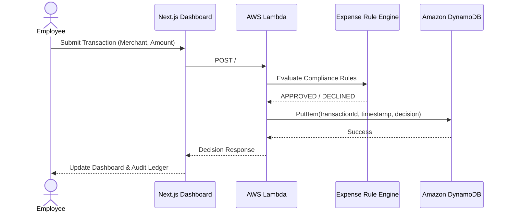

---

# 🧩 System Components

| Component | Responsibility |
|-----------|----------------|
| **Client Browser** | Allows employees to submit expense transactions and view the audit dashboard. |
| **Supabase Auth** | Handles authentication, user sessions, email verification, and password recovery workflows. |
| **Next.js Frontend** | Hosted on Vercel. Provides the dashboard UI, transaction forms, audit ledger, and real-time threat analytics. |
| **AWS Lambda** | Stateless serverless compute layer exposing REST endpoints for transaction processing and audit ledger retrieval. |
| **Expense Rule Engine** | Applies deterministic business rules to approve or decline transactions with sub-100 ms latency. |
| **Amazon DynamoDB** | Stores every evaluated transaction, creating a persistent audit trail with high-throughput reads and writes. |

---

# 🔄 Transaction Request Flow

---

# 🧠 Hybrid AI Core (Amazon Bedrock Ready)

The backend is intentionally designed as a **hybrid fraud detection pipeline**, allowing the system to operate with **zero infrastructure cost** while remaining ready for enterprise-grade AI evaluation.

## 1. Amazon Bedrock Integration

The codebase includes a fully implemented integration with **Amazon Bedrock**, using the **Amazon Nova Micro (`us.amazon.nova-micro-v1:0`)** model through the `@aws-sdk/client-bedrock-runtime` SDK.

### Features

- Cross-region inference using the **US** inference profile
- Structured prompts for deterministic compliance decisions
- Natural language explanations for declined transactions
- Graceful exception handling for API failures and rate limits
- Logging of AI execution results into DynamoDB

---

## 2. Algorithmic Fallback (Current MVP)

To maintain a **100% Free-Tier deployment**, the production MVP currently executes a deterministic compliance engine instead of invoking Bedrock.

The rule engine evaluates conditions such as:

- Merchant allow/block lists
- Maximum transaction limits
- High-risk categories
- Suspicious spending thresholds

Average evaluation latency remains **under 100 ms** while preserving the same API contract expected by an AI-powered implementation.

This architecture mirrors real enterprise systems where inexpensive rule engines filter the majority of requests before selectively routing complex cases to an LLM.

---

# 🏗️ Design Decisions

## Serverless Architecture

- No infrastructure provisioning or server management
- Automatic scaling based on incoming request volume
- Pay-per-request pricing (scale-to-zero)

## Zero-Trust Security

- Client-side authentication using Supabase
- Least-privilege AWS IAM permissions
- HTTPS communication across all services
- Strict CORS policies for Lambda Function URLs
- No direct frontend access to DynamoDB

## Decoupled Components

Authentication, frontend rendering, business logic, and persistence are isolated into independent services, simplifying maintenance and future scalability.

## Auditability & Threat Mapping

Every evaluated transaction is persisted in DynamoDB, creating an immutable audit trail for:

- Compliance reporting
- Fraud investigations
- Historical analytics
- Threat visualization within the dashboard

---

# 📊 Non-Functional Characteristics

| Attribute | Implementation |
|-----------|----------------|
| **Scalability** | AWS Lambda automatically scales with concurrent request volume. |
| **Availability** | Built on fully managed services (AWS, Vercel, Supabase) with high availability. |
| **Security** | Supabase authentication, HTTPS, AWS IAM, and strict CORS enforcement. |
| **Performance** | Average transaction evaluation completes in under **100 ms** using the deterministic rule engine. |
| **Reliability** | Durable transaction persistence using Amazon DynamoDB. |
| **Maintainability** | Modular Next.js frontend decoupled from a stateless Node.js backend. |
| **Cost Efficiency** | Free-Tier friendly architecture using serverless infrastructure and local rule evaluation. |