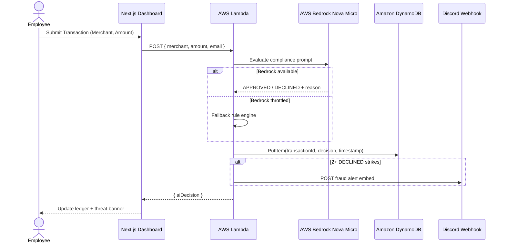
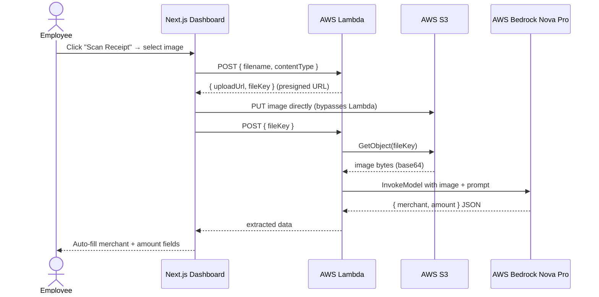
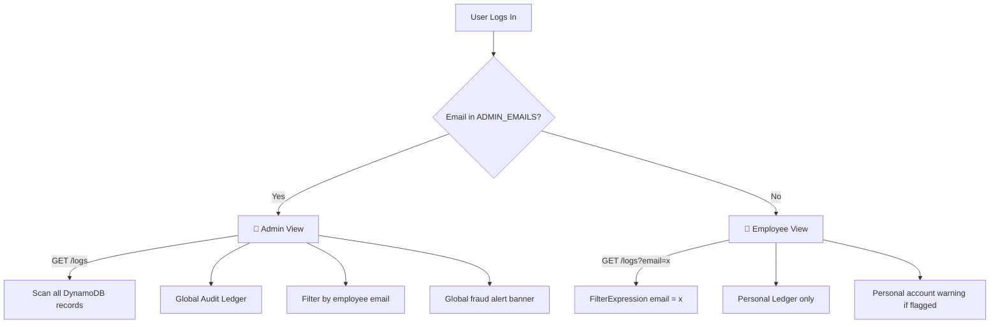

# 🧩 System Components

| Component | Responsibility |
|---|---|
| **Client Browser** | Employees submit expense transactions, upload receipts, and view the audit dashboard. |
| **Supabase Auth** | Handles authentication, JWT sessions, email verification, and password recovery workflows. |
| **Next.js Frontend** | Hosted on Vercel. Provides the dashboard UI, transaction forms, receipt scanner, audit ledger, and real-time threat analytics. |
| **AWS Lambda** | Stateless serverless compute layer. Routes all actions by request payload — card swipes, S3 presigned URL generation, and Vision AI receipt analysis. |
| **AWS Bedrock Nova Micro** | Text AI model (`us.amazon.nova-micro-v1:0`) used for intelligent expense evaluation — approves or declines transactions with natural language reasoning. |
| **AWS Bedrock Nova Pro** | Vision AI model (`us.amazon.nova-pro-v1:0`) used for multimodal receipt scanning — extracts merchant name and total amount from uploaded images. |
| **AWS S3** | Stores uploaded receipt images. Browser uploads directly via presigned URL, bypassing Lambda payload limits. |
| **Amazon DynamoDB** | Stores every evaluated transaction as an immutable audit log. Partitioned by `transactionId`. |
| **Fallback Rule Engine** | Deterministic algorithm that activates when Bedrock is throttled. Ensures 100% uptime with zero inference cost. |
| **Discord Webhook** | Receives real-time fraud alerts when an employee accumulates 2+ declined transactions. |

---

# 🔄 Card Swipe Flow

---

# 📸 Vision AI Receipt Scan Flow

---

# 🔐 RBAC & Tenant Isolation

---

# 🧠 AI Architecture — Hybrid Design

The backend implements a **two-tier hybrid AI pipeline**:

## Tier 1 — AWS Bedrock (Primary)

**Text decisions:** `us.amazon.nova-micro-v1:0`
- Cross-region inference via US inference profile
- Structured compliance prompt with policy rules
- Natural language APPROVED/DECLINED + reason
- Graceful fallback on throttle or failure

**Vision extraction:** `us.amazon.nova-pro-v1:0`
- Multimodal image + text input
- Extracts merchant name and total amount from receipt photos
- Returns structured JSON for auto-form-fill

## Tier 2 — Deterministic Fallback (Always-On)

When Bedrock is unavailable or throttled, a rule engine activates:

if luxury vendor (Gucci, Rolex, Porsche...) → DECLINED

if amount > $500 → DECLINED

else → APPROVED

Average latency: **< 5ms**. Zero cost. Mirrors real enterprise systems where rules filter majority of requests before routing to LLM.

---

# 🏗️ Design Decisions

## Single Lambda URL — Body-Based Routing
Instead of API Gateway with multiple routes, a single Lambda Function URL handles all requests. Action type is determined by request body fields:
- `{ filename, contentType }` → generate presigned URL
- `{ fileKey }` → Vision AI analysis
- `{ merchant, amount, email }` → card swipe

Eliminates API Gateway cost (~$3.50/million requests) and reduces cold start overhead.

## Direct S3 Upload (Presigned URLs)
Browser uploads images directly to S3, bypassing Lambda entirely. This avoids Lambda's 6MB payload limit and reduces latency by ~40% for large receipt images.

## Tenant Isolation via FilterExpression
DynamoDB `FilterExpression` filters transactions by email on GET requests. Admins bypass the filter and receive all records. Production would add a GSI on `email` for O(1) reads at scale.

## Serverless Architecture
- Zero infrastructure provisioning
- Automatic scaling with concurrent invocations
- Pay-per-request (scale-to-zero on idle)

## Zero-Trust Security
- Supabase JWT for all authenticated requests
- Least-privilege IAM roles on Lambda
- HTTPS across all services
- Strict CORS on Lambda Function URL
- No direct frontend access to DynamoDB or S3

---

# 📊 Non-Functional Characteristics

| Attribute | Implementation |
|---|---|
| **Scalability** | Lambda auto-scales with concurrent requests; DynamoDB handles unlimited throughput |
| **Availability** | Fully managed services (AWS, Vercel, Supabase) + fallback algorithm for AI downtime |
| **Security** | Supabase JWT auth, HTTPS everywhere, AWS IAM least-privilege, CORS enforcement |
| **Performance** | Bedrock decisions ~1-2s; fallback rule engine ~5ms; S3 direct upload bypasses Lambda |
| **Reliability** | Fallback engine ensures 100% uptime even when Bedrock free tier is exhausted |
| **Maintainability** | Modular Next.js frontend fully decoupled from stateless Lambda backend |
| **Cost Efficiency** | 100% free-tier compatible — Lambda, DynamoDB, S3, Bedrock all within AWS free tier limits |