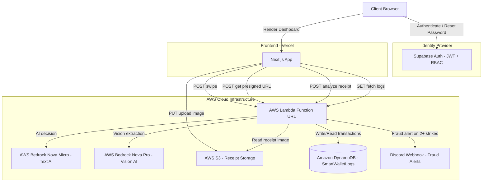

# 💳 SmartWallet AI – Enterprise Corporate Expense Compliance Engine


A **production-grade, serverless corporate expense management system** with Zero-Trust security, multimodal Vision AI receipt scanning, real-time fraud detection, and live Discord webhook alerts.

🔗 **Live Demo:** [smartwallet-ai-rho.vercel.app](https://smartwallet-ai-rho.vercel.app)

---

## 🏗 System Architecture



---

## ✅ Feature Breakdown

### 🔐 V1 — Core Foundation

| Feature | Implementation |
|---|---|
| Authentication | Supabase Auth — signup, login, session management |
| Password Recovery | Forgot password flow with Supabase SMTP email + in-app reset UI |
| Card Swipe | POST to Lambda → AI evaluation → DynamoDB write |
| Audit Ledger | Real-time transaction table with timestamps |
| Threat Analytics | Frontend flags users with 2+ DECLINED strikes in last 24 hours |

### 🚀 V2 — Enterprise Grade

| Feature | Implementation |
|---|---|
| **Role-Based Access Control** | Admin vs Employee roles with asymmetric UI |
| **Tenant Isolation** | Employees see only their own transactions; Admins see global ledger |
| **Vision AI Receipt Scanning** | Upload receipt → S3 presigned URL → Bedrock Nova Pro reads image → auto-fills merchant + amount |
| **Real-Time Fraud Webhooks** | Discord alert fires instantly when employee hits 2+ strikes |
| **Asymmetric Threat UI** | Admins see global fraud banner; employees see personal account warning |
| **AI + Fallback Engine** | Bedrock Nova Micro for AI decisions; deterministic rule engine activates on throttle — zero downtime |

---

## 🛠 Tech Stack

| Layer | Technology |
|---|---|
| **Frontend** | Next.js 15, React, Tailwind CSS |
| **Hosting** | Vercel (CI/CD via GitHub push) |
| **Auth** | Supabase Auth (JWT sessions, SMTP email) |
| **Backend** | AWS Lambda (Node.js 24.x, ES Modules) |
| **AI — Text** | AWS Bedrock Nova Micro (`us.amazon.nova-micro-v1:0`) |
| **AI — Vision** | AWS Bedrock Nova Pro (`us.amazon.nova-pro-v1:0`) |
| **Storage** | AWS S3 (`ap-south-1`) — receipt image uploads via presigned URLs |
| **Database** | Amazon DynamoDB (`ap-south-1`) — NoSQL audit logs |
| **Alerts** | Discord Webhooks — real-time fraud notifications |

---

## 🔑 Key Engineering Decisions

**1. Body-based Lambda routing** — Single Lambda Function URL handles all actions (presigned URL, vision AI, card swipe) routed by request payload, not URL paths. Eliminates API Gateway cost and complexity.

**2. Cross-region Bedrock** — Bedrock client in `us-east-1`, DynamoDB + S3 in `ap-south-1`. Nova models require US cross-region inference profiles (`us.` prefix).

**3. Direct S3 upload** — Browser uploads receipt images directly to S3 via presigned URL, bypassing Lambda entirely. Avoids 6MB Lambda payload limit and reduces latency.

**4. AI + Fallback hybrid** — When Bedrock throttles (free tier daily limit), a deterministic rule engine activates automatically. App never goes down during a demo.

**5. Tenant isolation without a GSI** — DynamoDB FilterExpression on email field. Sufficient for MVP scale; production would use a GSI on email for O(1) reads.

**6. Asymmetric threat UI** — Admins and employees see different threat information. Admins see global fraud alerts; employees only see warnings about their own account. Mirrors real enterprise SIEM design.

---

## 📁 Project Structure

smartwallet-ai/

├── app/

│   └── page.tsx          # Full frontend — auth, dashboard, receipt scanner

├── utils/

│   └── supabase.ts       # Supabase client singleton

├── lambda/

│   └── index.mjs         # AWS Lambda — all backend logic

├── ARCHITECTURE.md       # Deep dive system design & data flows

└── README.md

---

## 🚀 Local Setup

```bash
git clone https://github.com/prajjwalsingh11/smartwallet-ai
cd smartwallet-ai
npm install
```

Create `.env.local`:

NEXT_PUBLIC_SUPABASE_URL=your_supabase_url

NEXT_PUBLIC_SUPABASE_ANON_KEY=your_supabase_anon_key

NEXT_PUBLIC_AWS_API_URL=your_lambda_function_url

```bash
npm run dev
```

### Lambda Deployment

See [`lambda/index.mjs`](./lambda/index.mjs) for the complete backend code.

**Required Lambda environment variables:**

DISCORD_WEBHOOK_URL=your_discord_webhook_url

**Required IAM policies on Lambda execution role:**
- `AmazonBedrockFullAccess`
- `AmazonDynamoDBFullAccess`
- `AmazonS3FullAccess`

---

## 🎯 Resume Keywords

`Next.js` `AWS Lambda` `AWS Bedrock` `Vision AI` `Multimodal AI` `AWS S3` `Amazon DynamoDB` `Supabase Auth` `Serverless Architecture` `Zero-Trust Security` `RBAC` `Tenant Isolation` `Event-Driven Architecture` `Discord Webhooks` `Real-Time Fraud Detection` `Presigned URLs` `NoSQL` `JWT Authentication` `Node.js ES Modules` `Vercel CI/CD`